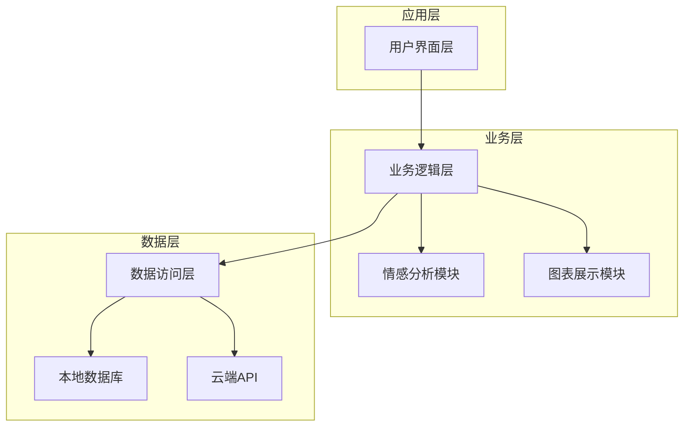
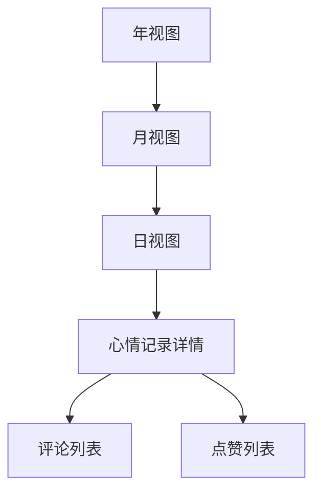

# 心情树洞系统设计文档

## 1. 概述

心情树洞系统是一个基于C#开发的个人情绪记录与分析应用，允许用户记录每日心情、进行情感分析、与好友互动，并提供数据可视化功能。系统整合了日历控件、树形结构数据模型、情感量化算法等技术，为用户提供完整的情绪管理解决方案。

### 1.1 核心功能
- 基于日历控件的日期关联心情记录
- 多维度情绪标签分类
- 树形结构心情日志可视化
- 情感分析自动生成情绪曲线
- 匿名/实名双模式隐私切换
- 好友互动点赞评论系统
- 历史心情数据统计图表
- 自定义心情表情包上传
- 跨平台数据云端同步
- 基于LINQ的智能搜索过滤

## 2. 技术架构

### 2.1 技术栈
- **开发语言**: C#
- **UI框架**: Windows Forms
- **数据存储**: SQLite本地数据库 + 云端同步
- **数据处理**: LINQ查询、异步数据处理
- **情感分析**: 自然语言处理算法
- **图表展示**: 图表控件库
- **云同步**: RESTful API接口

### 2.2 系统架构图

## 3. 核心模块设计

### 3.1 用户界面层

#### 3.1.1 主界面设计
- 顶部导航栏：包含日历视图、心情记录、好友互动、个人中心等模块入口
- 中部内容区：根据用户选择显示不同的功能模块
- 底部状态栏：显示用户登录状态、同步状态等信息

#### 3.1.2 日历控件模块
- 集成第三方日历控件
- 高亮显示有心情记录的日期
- 点击日期可查看/添加当日心情记录

#### 3.1.3 心情记录模块
- 心情文本输入框
- 情绪标签选择器
- 表情包选择/上传功能
- 位置信息记录（可选）
- 隐私模式切换按钮

### 3.2 业务逻辑层

#### 3.2.1 心情记录管理
- 心情记录的增删改查操作
- 心情数据的验证和处理
- 心情记录与日期的关联处理

#### 3.2.2 情绪标签分类系统
- 预定义情绪标签（如：开心、悲伤、愤怒、焦虑、平静等）
- 支持用户自定义情绪标签
- 多维度标签分类（按情绪类型、强度、触发因素等）

#### 3.2.3 情感分析模块
- 基于自然语言处理的心情文本分析
- 自动生成情绪强度评分
- 生成情绪变化曲线图

#### 3.2.4 隐私管理模块
- 匿名/实名模式切换
- 心情记录可见性设置
- 好友访问权限控制

#### 3.2.5 好友互动模块
- 好友添加/删除功能
- 心情点赞功能
- 心情评论功能
- 消息通知系统

#### 3.2.6 数据统计模块
- 历史心情数据分析
- 情绪变化趋势图表
- 情绪分布饼图
- 月度/年度情绪报告

#### 3.2.7 搜索过滤模块
- 基于LINQ的智能搜索
- 多条件过滤（时间范围、情绪标签、关键词等）
- 搜索结果展示

#### 3.2.8 云同步模块
- 数据上传到云端
- 数据从云端下载
- 冲突解决机制
- 同步状态监控

### 3.3 数据访问层

#### 3.3.1 本地数据库设计

##### 用户表 (Users)
| 字段名 | 数据类型 | 说明 |
|--------|----------|------|
| UserId | int | 用户ID（主键） |
| Username | string | 用户名 |
| Password | string | 密码（加密存储） |
| Email | string | 邮箱 |
| CreatedAt | DateTime | 注册时间 |
| LastLogin | DateTime | 最后登录时间 |

##### 心情记录表 (MoodRecords)
| 字段名 | 数据类型 | 说明 |
|--------|----------|------|
| RecordId | int | 记录ID（主键） |
| UserId | int | 用户ID（外键） |
| RecordDate | DateTime | 记录日期 |
| MoodText | string | 心情文本 |
| MoodScore | int | 情绪评分 |
| PrivacyMode | int | 隐私模式（0-匿名，1-实名） |
| Location | string | 位置信息 |
| CreatedAt | DateTime | 创建时间 |

##### 情绪标签表 (MoodTags)
| 字段名 | 数据类型 | 说明 |
|--------|----------|------|
| TagId | int | 标签ID（主键） |
| TagName | string | 标签名称 |
| TagCategory | string | 标签分类 |
| Color | string | 标签颜色 |

##### 记录标签关联表 (RecordTags)
| 字段名 | 数据类型 | 说明 |
|--------|----------|------|
| RecordId | int | 记录ID（外键） |
| TagId | int | 标签ID（外键） |

##### 好友关系表 (Friends)
| 字段名 | 数据类型 | 说明 |
|--------|----------|------|
| UserId | int | 用户ID（外键） |
| FriendId | int | 好友ID（外键） |
| Status | int | 关系状态（0-待确认，1-已确认） |
| CreatedAt | DateTime | 创建时间 |

##### 点赞表 (Likes)
| 字段名 | 数据类型 | 说明 |
|--------|----------|------|
| LikeId | int | 点赞ID（主键） |
| RecordId | int | 记录ID（外键） |
| UserId | int | 用户ID（外键） |
| CreatedAt | DateTime | 点赞时间 |

##### 评论表 (Comments)
| 字段名 | 数据类型 | 说明 |
|--------|----------|------|
| CommentId | int | 评论ID（主键） |
| RecordId | int | 记录ID（外键） |
| UserId | int | 用户ID（外键） |
| CommentText | string | 评论内容 |
| CreatedAt | DateTime | 评论时间 |

##### 表情包表 (Emojis)
| 字段名 | 数据类型 | 说明 |
|--------|----------|------|
| EmojiId | int | 表情包ID（主键） |
| UserId | int | 用户ID（外键，系统表情包为0） |
| EmojiName | string | 表情名称 |
| EmojiPath | string | 表情文件路径 |
| CreatedAt | DateTime | 创建时间 |

##### 记录表情关联表 (RecordEmojis)
| 字段名 | 数据类型 | 说明 |
|--------|----------|------|
| RecordId | int | 记录ID（外键） |
| EmojiId | int | 表情ID（外键） |

#### 3.3.2 云端API接口设计

##### 用户认证接口
- POST /api/auth/register - 用户注册
- POST /api/auth/login - 用户登录
- POST /api/auth/logout - 用户登出

##### 心情记录接口
- GET /api/moods - 获取心情记录列表
- POST /api/moods - 创建心情记录
- PUT /api/moods/{id} - 更新心情记录
- DELETE /api/moods/{id} - 删除心情记录

##### 好友互动接口
- GET /api/friends - 获取好友列表
- POST /api/friends - 添加好友
- DELETE /api/friends/{id} - 删除好友
- GET /api/likes - 获取点赞列表
- POST /api/likes - 添加点赞
- DELETE /api/likes/{id} - 取消点赞
- GET /api/comments - 获取评论列表
- POST /api/comments - 添加评论
- DELETE /api/comments/{id} - 删除评论

##### 数据同步接口
- GET /api/sync - 获取云端数据
- POST /api/sync - 上传本地数据

## 4. 核心功能实现方案

### 4.1 树形结构心情日志可视化

### 4.2 情感分析算法
1. 基于情感词典的文本分析
2. 情绪强度评分计算
3. 情绪变化趋势分析
4. 生成情绪曲线图

### 4.3 异步数据处理
- 使用async/await模式处理数据库操作
- 异步加载心情记录列表
- 异步上传/下载云端数据
- 异步生成图表数据

### 4.4 LINQ智能搜索过滤
- 多条件组合查询
- 模糊匹配算法
- 搜索结果排序
- 分页显示结果

## 5. 安全设计

### 5.1 数据安全
- 用户密码加密存储
- 敏感数据传输加密
- 本地数据加密存储

### 5.2 隐私保护
- 匿名/实名模式切换
- 心情记录可见性控制
- 好友访问权限管理

### 5.3 系统安全
- 用户身份认证
- 接口访问权限控制
- SQL注入防护
- XSS攻击防护

## 6. 性能优化

### 6.1 数据库优化
- 合理设计索引
- 查询语句优化
- 数据分页加载

### 6.2 界面优化
- 异步加载数据
- 图片懒加载
- 界面响应优化

### 6.3 网络优化
- 数据压缩传输
- 断点续传机制
- 网络状态监控

## 7. 测试策略

### 7.1 单元测试
- 数据访问层测试
- 业务逻辑层测试
- 情感分析算法测试

### 7.2 集成测试
- 数据库操作测试
- API接口测试
- 界面交互测试

### 7.3 性能测试
- 数据库查询性能测试
- 网络传输性能测试
- 界面响应性能测试

## 8. 部署方案

### 8.1 本地部署
- Windows Forms应用程序
- SQLite本地数据库
- 本地文件存储

### 8.2 云端部署
- RESTful API服务
- 云端数据库
- 文件存储服务